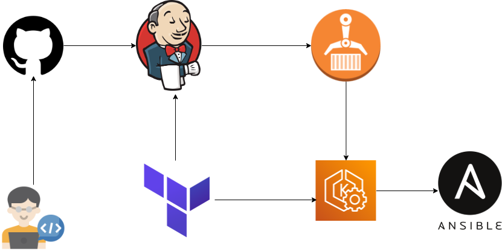
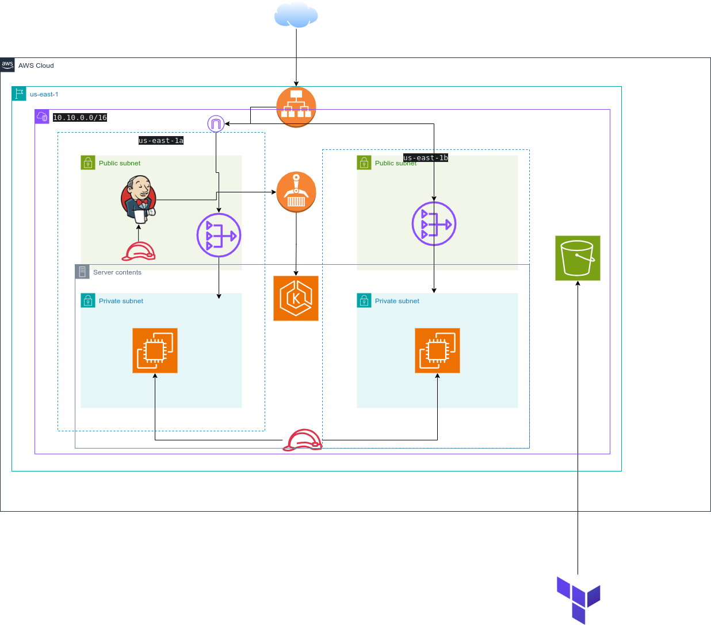

# DevOps Microservices Practice Project: Flask App on EKS

This project demonstrates a full CI/CD pipeline using various DevOps tools to build, test, and deploy a Python Flask microservices application (Authentication & Video services) onto a Kubernetes cluster managed by AWS EKS. The entire infrastructure (Jenkins Server, VPC, EKS Cluster) is provisioned using Terraform.


---

## Tools Used

*   **Git & GitHub:** Version Control System & Source Code Management.
*   **Terraform:** Infrastructure as Code (IaC) for provisioning all AWS resources.
*   **AWS:** Cloud Provider (EC2, EKS, ECR, S3, DynamoDB, IAM, VPC, ELB).
*   **Docker:** Containerization for packaging the Flask applications and dependencies.
*   **Jenkins:** CI/CD Orchestration server, running the pipeline defined in `Jenkinsfile`.
*   **Kubernetes (via EKS):** Container orchestration platform.
*   **Ansible :Configuration management.
*   **Python & Flask:** Application framework.
*   **Gunicorn:** Production WSGI server.
*   **Draw.io / diagrams.net:** Used for creating architecture diagrams.

---

## Architecture & Workflow Overview

This project utilizes a combination of Infrastructure as Code (IaC), CI/CD automation, and container orchestration to deliver the microservices application.

### CI/CD Pipeline Workflow

The following diagram illustrates the automated pipeline triggered by code changes:




**Explanation:**

1.  **Trigger:** A developer pushes code changes (`git push`) to the GitHub repository.
2.  **Jenkins Activation:** GitHub triggers Jenkins (via webhook or polling) based on the branch update.
3.  **Pipeline Execution (Jenkins):**
    *   **Checkout:** Jenkins checks out the latest code, including the `Jenkinsfile`.
    *   **Setup:** Configures necessary tools (`kubectl`, `aws cli`) and logs into AWS ECR using the permissions granted by the EC2 instance's IAM Role.
    *   **Build:** Builds Docker images for the `auth_service` and `video_service` using their respective Dockerfiles. Images are tagged uniquely (e.g., with the build number).
    *   **(Test):** Placeholder stages for running unit, integration, or other automated tests against the built code/images.
    *   **Push:** Pushes the tagged Docker images to AWS Elastic Container Registry (ECR).
    *   **Deploy:** Uses `kubectl` to apply the Kubernetes manifest files (`k8s/`) to the target EKS cluster. The image tags within the Deployment manifests are updated to use the newly built images from ECR. Kubernetes then handles the rolling update.
    *   **(Post-Deploy Test):** Placeholder stage for running end-to-end tests against the deployed application endpoint.
4.  **Deployment:** AWS EKS pulls the new container images from ECR and updates the running application pods according to the Deployment strategy.

### Cloud Infrastructure Architecture

The underlying infrastructure supporting this pipeline and application deployment is provisioned on AWS using Terraform, as depicted below:




**Explanation:**

1.  **VPC:** A dedicated Virtual Private Cloud provides network isolation. It spans multiple Availability Zones (AZs) for high availability.
2.  **Subnets:**
    *   **Public Subnets:** Contain resources that need direct internet access, like NAT Gateways and potentially the Jenkins server (with strict Security Groups). Connected to an Internet Gateway (IGW).
    *   **Private Subnets:** Host the EKS Worker Nodes (EC2 instances) for enhanced security. Outbound internet access (e.g., for pulling images or OS updates) is routed through NAT Gateways located in the public subnets.
3.  **EKS Cluster:**
    *   **Control Plane:** Managed by AWS, interacts with worker nodes.
    *   **Worker Nodes:** EC2 instances running in private subnets across multiple AZs, managed by an EKS Node Group. They execute the application pods.
4.  **Jenkins Server:** An EC2 instance (provisioned via Terraform) running the Jenkins application. It has an attached IAM Role (`JenkinsEC2Role`) granting it permissions to interact with AWS services like ECR and EKS. Resides in a public or private subnet depending on configuration.
5.  **ECR:** AWS Elastic Container Registry stores the Docker images built by the Jenkins pipeline. EKS worker nodes pull images from ECR.
6.  **ELB:** An AWS Elastic Load Balancer (typically an Application Load Balancer) is automatically provisioned by the Kubernetes `video-service` (Type: LoadBalancer). It routes external user traffic to the `video-service` pods running on the EKS worker nodes.
7.  **S3 & DynamoDB:** Used by Terraform as a remote backend to securely store the infrastructure state (S3) and manage state locking (DynamoDB) for collaborative and safe IaC practices.
8.  **IAM:** AWS Identity and Access Management roles and policies are defined to grant least-privilege permissions to Jenkins, EKS, and worker nodes.
9.  **Security Groups:** Act as virtual firewalls, controlling traffic flow between resources (e.g., allowing Jenkins to talk to the EKS API, ELB to talk to worker nodes, nodes to talk to each other).

---


## Prerequisites


1.  **AWS Account:** ...
2.  **Git & GitHub Account:** ...
3.  **Terraform:** ...
4.  **kubectl:** ...
5.  **EC2 Key Pair:** ...
6.  **S3 Bucket:** ...
7.  **DynamoDB Table:** ...

---

## Setup Instructions


1.  **Clone Repository:** ...
2.  **Configure AWS CLI:** ...
3.  **Prepare Jenkins Infra Variables:** ...
4.  **Provision Jenkins Server:** ...
5.  **Configure Jenkins UI:** ...
6.  **Prepare EKS Infra Variables:** ...
7.  **Provision EKS Cluster & VPC:** ...
8.  **Create ECR Repositories:** ...
9.  **Create Jenkins Pipeline Job:** ...

---

## Running the Pipeline


*   **Automatic Trigger:** ...
*   **Manual Trigger:** ...

---

## Cleaning Up

To avoid ongoing AWS charges, destroy the infrastructure when you are finished:

1.  **Destroy EKS Infrastructure:**
    ```bash
    cd ../eks-infra
    terraform destroy
    ```
2.  **Destroy Jenkins Infrastructure:**
    ```bash
    cd ../jenkins-infra
    terraform destroy -var-file=terraform.tfvars
    ```
3.  **Manual Cleanup:** Delete the ECR repositories, the S3 bucket contents (and bucket), and the DynamoDB table if you no longer need them. Check for any leftover Elastic IPs or Load Balancers in the EC2 console.
